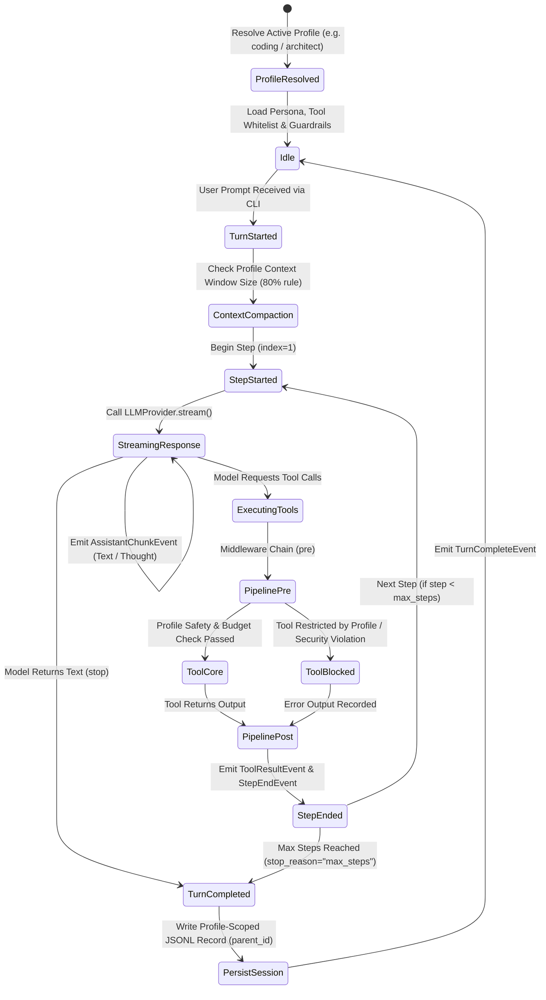

# Feature Spec: Mia Core Agent Harness (`specs/mia_harness.md`)

> **Author:** Principal Software Architect  
> **Status:** Approved 2-Phase Roadmap (Phase 1: v0.1.0 Core Engine & Rich CLI | Phase 2: v0.2.0 Textual TUI)  
> **Target Runtime:** Python 3.12+ (Pydantic v2, AnyIO, Typer, Rich)  
> **Reference Architecture:** Tau (Auth, Credentials, Context Window Compaction & JSONL Tree), Pi (AI Streaming & Terminal Renderers), DeepSeek Harness (Onion Middleware Pipeline, Monotonic Guards & Presets), Hermes (Declarative Profiles & Workspace Isolation)

---

## 1. Problem Statement & Acceptance Criteria (`elaborate-spec`)

### Problem Statement
Modern AI coding agents face tradeoffs between simplicity, extensibility, and user customization:
1. **Monolithic & Rigid (Pi/Tau):** Directly hardwires a single global persona, static system prompt, and fixed toolset into the central agent loop.
2. **Microkernel Indirection (DeepSeek Harness):** Extensible pipeline with presets and guardrails, but complex multi-process indirection.
3. **Ergonomic Persona Switching (Hermes):** Clean profile concept allowing developers to seamlessly switch between coding, architecture review, research, and minimal modes.

### The 2-Phase Strategy
- **Phase 1 (v0.1.0 - Core Engine & Rich CLI):** Build a rock-solid, test-driven headless agent loop, DSH onion middleware pipeline, Hermes+DSH declarative profiles, Tau-style credentials/auth, durable JSONL tree sessions with 80% context compaction, coding tools suite, and fast Rich terminal CLI.
- **Phase 2 (v0.2.0 - Dedicated TUI Sprint):** Full-screen interactive Textual TUI with custom widgets, collapsible cards, and modal confirmations consuming the same `AgentEvent` streams.

### Acceptance Criteria (Phase 1 / v0.1.0 Release)
- [x] **AC-1 (Multi-Provider Streaming):** Unified async generator streams yielding typed `StreamChunk` events for text, thoughts (DeepSeek-R1 / OpenAI reasoning), tool calls, and token usage.
- [x] **AC-2 (Headless Agent Loop):** Deterministic `AgentHarness` coordinating multi-turn and multi-step cycles, emitting typed `AgentEvent`s without direct UI imports.
- [x] **AC-3 (Onion Middleware Pipeline):** Tool calls pass through ordered async middlewares (`SecurityGuardMiddleware`, `CostBudgetMiddleware`, `AuditLogMiddleware`).
- [x] **AC-4 (Standard Coding Tools Suite):** Robust `read_file` (with line numbering & pagination), `write_file` (atomic write with parent dir creation), `edit_file` (exact single-match replacement with CRLF/BOM preservation and unified diffs), and `bash` (process group isolation `killpg` on timeout).
- [x] **AC-5 (Hermes + DSH Profile System):** Declarative profiles (`coding`, `architect`, `minimal`, `code_mode` + user-defined `~/.mia/profiles/<name>.toml`) controlling persona, models, tool whitelists, middleware guardrails, and session isolation.
- [x] **AC-6 (Tau-Style Credentials & Config):** Credential store under `~/.mia/credentials.json`, environment variable fallback, `~/.mia/config.toml` defaults, and `mia login <provider>` CLI command.
- [x] **AC-7 (Durable Tree Sessions & Context Compaction):** JSONL session persistence with `parent_id` pointers per profile, branch navigation, and structured context compaction when active context reaches 80% limit.
- [x] **AC-8 (Fast Rich Terminal CLI):** High-performance streaming CLI (`mia run --profile <name> -p "..."`, `mia profile list`, `mia login`, `mia sessions`) with live syntax-highlighted streaming, tool execution panels, and diff rendering.

---

## 2. Domain Glossary (Ubiquitous Language) (`define-language`)

| Canonical Term | Strict Definition | Aliases to AVOID | Role in System |
| :--- | :--- | :--- | :--- |
| **`AgentProfile`** | Declarative configuration unit defining persona, model, tool whitelist, mode, and guardrails. | Persona, AgentConfig, Preset | Configuration blueprint in `mia_agent.profiles` |
| **`ProfileManager`** | Registry discovering built-in system profiles and user custom profiles in `~/.mia/profiles/`. | ProfileRegistry, AgentCatalog | Profile discovery & lifecycle |
| **`AgentEvent`** | Strongly-typed Pydantic model emitted during execution. | EventMessage, Action, Packet | Protocol contract across engine, CLI, and future TUI |
| **`AgentHarness`** | The central orchestrator driving turn execution, step limits, and tool dispatch. | AgentLoop, Engine, Manager | Core coordinator in `mia_agent` |
| **`Turn`** | The complete conversational exchange triggered by a single user prompt until completion. | Session, PromptCycle | High-level lifecycle unit |
| **`Step`** | A single model inference and subsequent tool invocation within a turn. | Round, Iteration, Tick | Unit of inference and token accounting |
| **`ToolPipeline`** | Ordered sequence of async middlewares wrapping tool execution in an onion pattern. | MiddlewareStack, ToolFilter | Safety & observability gateway |
| **`ToolCallContext`** | Metadata container passed through middlewares (session ID, step index, tool name, args). | ToolRequest, MiddlewarePayload | Context object for guards and tracers |
| **`LLMProvider`** | Standardized async protocol translating provider-specific SSE streams into unified chunks. | AIClient, ModelWrapper | Multi-provider abstraction in `mia_ai` |
| **`CredentialStore`** | Local credential repository managing API keys and OAuth tokens (`~/.mia/credentials.json`). | AuthDB, KeyRing | Authentication layer in `mia_agent` |
| **`SessionStore`** | Append-only JSONL persistence engine with tree-branching support (`~/.mia/sessions/<profile>/`). | HistoryDB, MessageLog | Durable conversation repository |
| **`ContextCompactor`** | Algorithm that summarizes older conversation turns when context window reaches 80% capacity. | MemoryPruner, Truncator | Context window management |

---

## 3. Domain Model & Invariants (`model-domain`)

### 3.1. Turn & Step State Machine with Profile Scoping

### 3.2. Non-Negotiable Domain Invariants
- *Invariant 1:* The active profile **strictly constrains visible tool schemas**; a restricted tool's schema is never presented to the LLM.
- *Invariant 2:* The core engine (`mia_agent`) **must never** directly write to stdout or Rich console. All communication happens exclusively through `AgentEvent` streams.
- *Invariant 3:* Every tool invocation **must pass through the `ToolPipeline`** before touching disk or OS processes.
- *Invariant 4:* File edits (`edit_file`) **must fail atomically** with no modifications if any `oldText` pattern matches 0 times or $>1$ times.
- *Invariant 5:* Subprocess execution (`bash`) **must spawn a dedicated process group** and terminate the entire process group (`os.killpg`) upon timeout or cancellation to prevent orphaned zombie processes.
- *Invariant 6:* Context compaction **must preserve the original JSONL tree on disk untouched**; compaction only compresses in-memory messages presented to the model.

---

## 4. Built-in Profiles Catalog

| Profile ID | Display Name | Purpose & Persona | Allowed Tools | Execution Mode | Permission Policy |
| :--- | :--- | :--- | :--- | :--- | :--- |
| **`coding`** (Default) | Full Software Engineer | Full-stack coding, debugging, refactoring, and test execution | `read_file`, `write_file`, `edit_file`, `bash` | `native` | `standard` (safety filter active) |
| **`architect`** | System Architect | Read-only architecture review, ADR drafting, schema analysis | `read_file` | `native` | `read_only` (mutations blocked) |
| **`code_mode`** | DSH Programmatic | Batch multi-tool executions via Python SDK code scripts | `run_code`, `read_file`, `write_file`, `edit_file`, `bash` | `code` | `standard` |
| **`minimal`** | Conversational / Fast | Quick answers, reasoning, brainstorming with zero tool overhead | `(none)` | `native` | `no_tools` |

---

## 5. Phase 1 (v0.1.0) Vertical Slices & Tasks (`plan-work`)

### Slice 0: Workspace Organization & Tooling Scaffold
- [x] Task 0.1: Group initial plan docs into `docs/initial_plan/` and write clean root `README.md`.
  - *Verify:* `test -f docs/initial_plan/ARCHITECTURE.md && test -f README.md`
- [x] Task 0.2: Configure `pyproject.toml`, package manifests, and development dependencies.
  - *Verify:* `uv sync && uv run ruff check .`

### Slice 1: Multi-Provider LLM Streaming (`mia_ai`)
- [x] Task 1.1: Implement unified streaming types (`StreamChunk`, `ToolCall`, `TokenUsage`) and abstract `LLMProvider`.
  - *Files:* `src/mia_ai/types.py`, `src/mia_ai/providers/base.py`
  - *Verify:* `uv run mypy src/mia_ai/types.py src/mia_ai/providers/base.py`
- [x] Task 1.2: Implement `MockProvider`, `OpenAICompatibleProvider`, and `AnthropicProvider`.
  - *Files:* `src/mia_ai/providers/mock.py`, `src/mia_ai/providers/openai_compatible.py`, `src/mia_ai/providers/anthropic.py`
  - *Verify:* `uv run pytest tests/test_ai_streaming.py && uv run mypy src/mia_ai`

### Slice 2: Core Event Engine & Headless Agent Loop (`mia_agent`)
- [x] Task 2.1: Define `AgentEvent` Pydantic models with UTC timestamps.
  - *Files:* `src/mia_agent/events.py`
  - *Verify:* `uv run mypy src/mia_agent/events.py`
- [x] Task 2.2: Implement `AgentHarness` loop with step limits, tool dispatch, and event streaming.
  - *Files:* `src/mia_agent/harness.py`
  - *Verify:* `uv run pytest tests/test_agent_loop.py && uv run mypy src/mia_agent`

### Slice 3: Onion Middleware Pipeline (`mia_middleware`)
- [x] Task 3.1: Implement `ToolPipeline` and `ToolCallContext` with async onion dispatch.
  - *Files:* `src/mia_middleware/pipeline.py`
  - *Verify:* `uv run mypy src/mia_middleware/pipeline.py`
- [x] Task 3.2: Implement `SecurityGuardMiddleware`, `CostBudgetMiddleware`, and `AuditLogMiddleware`.
  - *Files:* `src/mia_middleware/security.py`, `src/mia_middleware/telemetry.py`
  - *Verify:* `uv run pytest tests/test_middleware_pipeline.py && uv run mypy src/mia_middleware`

### Slice 4: Standard Coding Tools Suite (`mia_tools`)
- [x] Task 4.1: Implement `BaseTool` and filesystem tools (`read_file`, `write_file`, `edit_file`).
  - *Files:* `src/mia_tools/base.py`, `src/mia_tools/fs.py`
  - *Verify:* `uv run pytest tests/test_tools.py -k fs`
- [x] Task 4.2: Implement `bash` subprocess execution with process group management.
  - *Files:* `src/mia_tools/bash.py`
  - *Verify:* `uv run pytest tests/test_tools.py && uv run mypy src/mia_tools`

### Slice 5: Hermes + DSH Profile System (`mia_agent.profiles`)
- [x] Task 5.1: Implement `AgentProfile` model and `ProfileManager` for built-in and user profiles (`~/.mia/profiles/`).
  - *Files:* `src/mia_agent/profiles/model.py`, `src/mia_agent/profiles/manager.py`
  - *Verify:* `uv run pytest tests/test_profiles.py`
- [x] Task 5.2: Integrate profile tool whitelisting and permission presets into `AgentHarness`.
  - *Files:* `src/mia_agent/harness.py`
  - *Verify:* `uv run pytest tests/test_profiles.py && uv run mypy src/mia_agent`

### Slice 6: Tau-Style Credentials, Auth & Provider Config (`mia_agent.auth`)
- [x] Task 6.1: Implement `FileCredentialStore` managing `~/.mia/credentials.json` with API keys and OAuth tokens.
  - *Files:* `src/mia_agent/auth/credentials.py`
  - *Verify:* `uv run pytest tests/test_credentials.py`
- [x] Task 6.2: Implement `ConfigManager` resolving settings hierarchy (`CLI flags` > `ENV vars` > `~/.mia/config.toml`).
  - *Files:* `src/mia_agent/auth/config.py`
  - *Verify:* `uv run pytest tests/test_credentials.py && uv run mypy src/mia_agent`

### Slice 7: Durable Session Storage & Context Compaction (`mia_agent.session`)
- [x] Task 7.1: Implement profile-scoped JSONL append-only storage and session resumption (`--resume`) with parent pointers.
  - *Files:* `src/mia_agent/session/jsonl.py`, `src/mia_agent/session/tree.py`
  - *Verify:* `uv run pytest tests/test_sessions.py`
- [x] Task 7.2: Implement `ContextCompactor` executing structured summarization at 80% token capacity.
  - *Files:* `src/mia_agent/session/compactor.py`
  - *Verify:* `uv run pytest tests/test_sessions.py && uv run mypy src/mia_agent`

### Slice 8: Fast CLI & Rich Streaming Print Mode (`mia_cli`)
- [x] Task 8.1: Implement Rich live streaming renderer for chunks, diffs, and tool panels.
  - *Files:* `src/mia_cli/renderers/rich_stream.py`
  - *Verify:* `uv run mypy src/mia_cli/renderers/rich_stream.py`
- [x] Task 8.2: Implement Typer CLI entrypoint (`mia run -p "..."`, `mia --profile <name>`, `mia profile list`, `mia login`, `mia sessions`).
  - *Files:* `src/mia_cli/main.py`
  - *Verify:* `uv run pytest tests/test_cli_print_mode.py && uv run mypy src/mia_cli`

---

## 6. Phase 2 (v0.2.0) Future Roadmap
- Dedicated Full-Screen Textual TUI Sprint (`mia_cli.tui`) with custom layout widgets, collapsible cards, and modal confirmations.
- MCP (Model Context Protocol) client integration.
- Native C Landlock sandboxing on Linux.
