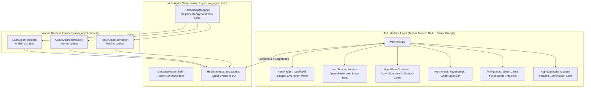

## 1. Architecture & Modern Visual Design System

### A. The "Carrot Orange" Modern Palette
Mia uses a sleek, contemporary dark canvas inspired by modern tools (Linear, Raycast, Zed, OpenCode) with **Carrot Orange** as the bold signature highlight:

* **Primary Highlight (Carrot Orange):** `#FF7A00` / `rgb(255, 122, 0)` (Active agent pills, focus borders, thinking drawer headers, primary buttons).
* **Carrot Hover/Light:** `#FF9E40` (Hovered items, active tab highlights).
* **Carrot Muted:** `#994A00` (Subtle accent glow, secondary badges).
* **Dark Obsidian Canvas:** `#0D0F12` (Main background).
* **Card Surface:** `#16191E` (Tool cards, message containers, transcript blocks).
* **Active Card Surface:** `#20242C` (Selected agent pane, active modal background).
* **Subtle Borders:** `#2B303B` (Crisp modern dividers without harsh ASCII lines).
* **State Badges:**
  * 🟢 **Working:** `#10B981` (Emerald Green pulse)
  * 🟡 **Blocked on Approval:** `#F59E0B` (Amber Alert)
  * 🔵 **Done:** `#3B82F6` (Electric Blue)
  * ⚪ **Idle:** `#6B7280` (Muted Slate)



---

## 2. Core Domain Models (`mia_agent.herd`)

### Agent Status Enum
```python
class AgentState(str, Enum):
    IDLE = "idle"  # Waiting for prompt or next task (⚪ Gray)
    WORKING = "working"  # Actively streaming LLM or executing tool (🟢 Green)
    BLOCKED = "blocked"  # Waiting for human approval on tool or shell command (🟡 Yellow)
    DONE = "done"  # Turn/Task complete (🔵 Blue)
    ERROR = "error"  # Turn aborted due to error (🔴 Red)
```

### Agent Descriptor
```python
class ManagedAgent(BaseModel):
    id: str  # e.g. "lead", "coder", "reviewer"
    name: str  # e.g. "Lead Architect", "Senior Coder"
    profile: str  # e.g. "architect", "coding", "minimal"
    model: str  # e.g. "mimo-v2.5", "claude-3-5-sonnet"
    state: AgentState = AgentState.IDLE
    current_step: int = 0
    max_steps: int = 25
    total_tokens: int = 0
    total_cost_usd: float = 0.0
    unread_messages: int = 0
    session_id: str
```

### Herd Events
* `AgentSpawnedEvent`: New worker instance initialized.
* `AgentStateChangedEvent`: Transition between `idle`, `working`, `blocked`, `done`, `error`.
* `AgentEventEnvelope`: Wraps any standard `AgentEvent` (e.g. `AssistantChunkEvent`, `ToolCallEvent`, `ToolResultEvent`) with `agent_id`.
* `InterAgentMessageEvent`: Message passed from `@lead` to `@coder`.

---

## 3. UI Component Hierarchy & Layout (`mia_cli.tui`)

### Layout Wireframe
```
┌─ Mia Herd v0.2.0 ────────────────────────────────────────── [Active: @coder] ── [mimo-v2.5] ─┐
│ HERD ROSTER         │ STREAM: @coder (Profile: coding)                                      │
│                     │                                                                        │
│ 🔵 @lead            │ 💭 Thinking: Analyzing the test failure in test_calc.py...            │
│    Lead Architect   │                                                                        │
│    Tokens: 1.2k     │ ▼ [Tool: edit_file("calculator.py")] ───────────────────── [✓ 1.1ms] ─│
│                     │ - return a - b                                                        │
│ 🟢 @coder*          │ + return a + b                                                        │
│    Senior Coder     │                                                                        │
│    Step: 3/10       │ I have patched calculator.py. Handing off to @tester for validation.  │
│                     │                                                                        │
│ 🟡 @tester          │                                                                        │
│    Test Engineer    │                                                                        │
│    Blocked Approval │                                                                        │
├─────────────────────┴────────────────────────────────────────────────────────────────────────┤
│ [1: @lead] [2: @coder*] [3: @tester] │ Alt+1..3: Switch │ Space: Approve │ Ctrl+N: New Agent │
├──────────────────────────────────────────────────────────────────────────────────────────────┤
│ > [@coder: Fix the typo in README.md / or type @tester to switch...]                        │
└──────────────────────────────────────────────────────────────────────────────────────────────┘
```

---

## 4. Work Breakdown Slices (Phase 2)

### Slice 9: Multi-Agent Herd Orchestration Engine (`mia_agent.herd`)
- [x] **Task 9.1:** Implement `ManagedAgent`, `AgentState`, and `HerdEventBus`.
- [x] **Task 9.2:** Implement `HerdManager` managing concurrent background `AgentHarness` loops, inter-agent delegation tool `invoke_subagent`, and state machine transitions.
- [x] **Task 9.3:** Unit & Scenario tests in `tests/test_herd_orchestrator.py`.

### Slice 10: OpenCode-Grade Stream Widgets (`mia_cli.tui.widgets`)
- [x] **Task 10.1:** Implement `ThoughtDrawer` widget (collapsible reasoning accordion with pulse/spin indicator).
- [x] **Task 10.2:** Implement `ToolCallCard` widget with status indicators, execution duration, and `Syntax` diff rendering for `edit_file`.
- [x] **Task 10.3:** Implement `AssistantMessageCard` with formatted Markdown.
- [x] **Task 10.4:** Implement `ApprovalModal` dialog for interactive security approval.

### Slice 11: Herdr Multiplexer Layout & Full Textual App (`mia_cli.tui`)
- [x] **Task 11.1:** Implement `HerdSidebar` with agent list items, state badges (🟢/🟡/🔵/🔴), token counters, and active selection.
- [x] **Task 11.2:** Implement `AgentPaneContainer` hosting independent scrollable transcripts for each agent.
- [x] **Task 11.3:** Implement `PromptInputBar` with multiline prompt prefix `🥕 >`, `@agent` mention autocomplete, and `/command` palette.
- [x] **Task 11.4:** Assemble `MiaHerdApp` connecting `HerdEventBus` to UI widgets with keyboard shortcuts (`Alt+1..9`, `Ctrl+N`, `Ctrl+C`, `Ctrl+Q`).

### Slice 12: CLI Launchers & End-to-End Testing
- [x] **Task 12.1:** Add `mia` (default launch to TUI) and `mia tui` commands in `src/mia_cli/main.py`.
- [x] **Task 12.2:** Automated pilot tests using Textual `App.run_test()` in `tests/test_tui_app.py`.
