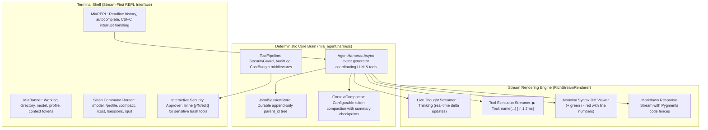

# Master Specification: Mia Interactive Stream Harness & Developer CLI

A permanent, version-controlled specification for the **Mia Interactive Coding Agent Harness**, designed for high-performance, stream-first terminal pair programming inspired by **Claude Code**, **Pi**, and **Aider**.

---

## 1. Architectural Blueprint & Philosophy

---

## 2. Palette & Visual Design Tokens (Carrot-Orange System)

| Token Name | Hex / Style | Purpose |
|---|---|---|
| **Signature Carrot** | `#FF7A00` / `[bold #FF7A00]` | Prompt prefix `🥕 mia >`, active highlights, thinking headers |
| **Carrot Dim** | `#994A00` | Secondary badges, divider accents |
| **Tool Header** | `#38BDF8` / `[bold cyan]` | Tool invocation names (`read_file`, `edit_file`, `bash`) |
| **Success Status** | `#10B981` / `[green]` | Tool execution success badge `[✓ 1.2ms]`, approvals |
| **Alert / Warning** | `#F59E0B` / `[yellow]` | Security guardrail interceptions, warnings |
| **Error Status** | `#EF4444` / `[bold red]` | Tool errors, rate-limits, validation failures |
| **Subtle Text** | `#6B7280` / `[dim]` | Timestamps, token usage counters, divider lines |

---

## 3. Interaction Specification & Command Reference

### Prompting Workflow
* **Default Launch:** `mia` starts the interactive REPL in the current directory.
* **Inline Streaming:** Real-time token streaming with live thinking thoughts and tool call execution.
* **Cancellation (`Ctrl+C`):** Interrupts an ongoing LLM generation or running bash tool without crashing the session.
* **Exit (`Ctrl+D` or `/quit`):** Saves session tree and exits cleanly.

### Slash Commands Reference
* `/help` — Display interactive command guide and available tool suite.
* `/model <name>` — Switch the active LLM (e.g. `/model mimo-v2.5`, `/model claude-3-5-sonnet`).
* `/profile <name>` — Switch the agent profile (`coding`, `architect`, `minimal`).
* `/compact` — Manually trigger structured context compaction and view summary checkpoint.
* `/cost` — Show token usage, compaction stats, and estimated USD cost.
* `/sessions` — List saved session trees for the active profile.
* `/clear` — Clear the terminal screen.
* `/quit` or `/exit` — Exit the REPL session.

---

## 4. Work Breakdown Slices

### Slice 1: Interactive Stream REPL Engine (`src/mia_cli/repl.py`)
- [x] **Task 1.1:** Build `MiaREPL` class with readline history persistence (`~/.mia/history`) and tab-completion for `/` commands.
- [x] **Task 1.2:** Integrate `RichStreamRenderer` for live thoughts, tool executions, and Monokai diffs.
- [x] **Task 1.3:** Implement graceful `Ctrl+C` turn interruption and `Ctrl+D` exit handling.

### Slice 2: Interactive Security & Guardrail Interception (`src/mia_middleware/`)
- [x] **Task 2.1:** Add interactive approval hook to `SecurityGuardMiddleware` for CLI prompts (`[y/N/edit]`).
- [x] **Task 2.2:** Support interactive editing of intercepted bash commands before execution.

### Slice 3: Slash Commands & In-Session Management
- [x] **Task 3.1:** Implement `/model`, `/profile`, `/compact`, `/cost`, `/sessions`, `/clear`, `/help`.
- [x] **Task 3.2:** Wire profile and model hot-swapping directly into the active `AgentHarness`.

### Slice 4: CLI Default Integration & Verification
- [x] **Task 4.1:** Wire `uv run mia` default invocation to launch `MiaREPL`.
- [x] **Task 4.2:** Retain `mia run -p "<instruction>"` for headless benchmark/scripting runs.
- [x] **Task 4.3:** Automated unit and scenario tests in `tests/test_cli_repl.py`.
- [x] **Task 4.4:** Full verification gate: `ruff`, `mypy`, `pytest` (100% passing).
