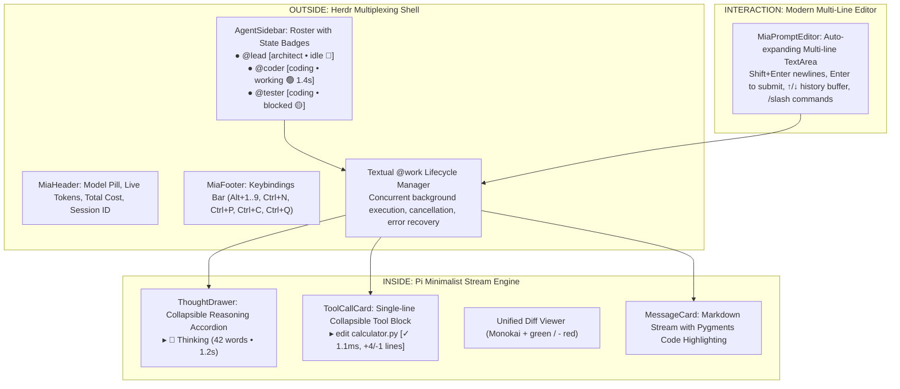

# Master Specification: Mia Production TUI & Multi-Agent Harness

A permanent, version-controlled specification for the **Mia Production Terminal User Interface**, combining:
1. **The Herdr Outer Shell:** Multi-agent operational state awareness (🟢 working, ⚪ idle, 🟡 blocked, 🔵 done), background concurrent execution, sidebar roster, and keyboard multiplexing (`Alt+1..9`).
2. **The Pi Inner Engine:** Minimalist clean transcript stream, compact collapsible tool disclosure blocks (`▸ edit file.py [✓ 1.1ms]`), Monokai unified diff syntax, and collapsible thought drawers.
3. **The OpenCode Prompt Editor:** Multi-line editing with auto-growth (2-8 lines), `Shift+Enter` newlines, `Enter` submission, command history (`↑`/`↓`), and slash command palette (`/model`, `/profile`, `/compact`, `/clear`, `/help`, `/quit`).
4. **Carrot-Orange Design System:** Deep obsidian matte canvas (`#0F1117`), card surfaces (`#181B22`), modern rounded borders (`#2D3342`), and vibrant Carrot Orange highlights (`#FF7A00`).

---

## 1. Architectural Blueprint

---

## 2. Palette & Visual Tokens

| Token Name | Hex Code | Purpose |
|---|---|---|
| **Canvas Background** | `#0F1117` | Deep obsidian matte background |
| **Card Surface** | `#181B22` | Floating card surfaces and panels |
| **Card Active Surface** | `#222632` | Active transcript pane and focused items |
| **Border Modern** | `#2D3342` | Clean structural dividers |
| **Signature Carrot** | `#FF7A00` | Primary highlights, prompt prefix `🥕 >`, active borders |
| **Carrot Glow / Light** | `#FF9E40` | Hover states, tab underlines |
| **Status Working** | `#10B981` | Emerald pulse for active LLM/tool execution |
| **Status Blocked** | `#F59E0B` | Amber alert when security approval is required |
| **Status Done** | `#3B82F6` | Electric Blue when task is completed |
| **Status Idle** | `#6B7280` | Muted Slate when waiting for input |

---

## 3. Detailed Work Breakdown & Acceptance Criteria

### Slice 1: High-Performance Worker Engine & Streaming Queue (`src/mia_cli/tui/`)
- [x] **Task 1.1:** Integrate Textual `@work(exclusive=False, thread=False)` worker lifecycle for managed background agent turns.
- [x] **Task 1.2:** Build high-throughput debounced text stream buffer to eliminate token-by-token Markdown re-parsing lag.
- [x] **Task 1.3:** Implement smart auto-scroll pinning that remains anchored to bottom during streaming unless user scrolls up.

### Slice 2: Production Multi-Line Prompt Editor (`src/mia_cli/tui/widgets/prompt_editor.py`)
- [x] **Task 2.1:** Implement `MiaPromptEditor` with auto-expanding multi-line editing (2 to 8 lines).
- [x] **Task 2.2:** Support `Enter` to submit, `Shift+Enter` or `Ctrl+J` for newlines.
- [x] **Task 2.3:** Command history cycling with `Up` / `Down` arrow keys when at boundaries.
- [x] **Task 2.4:** Slash command parser (`/model`, `/profile`, `/compact`, `/clear`, `/help`, `/quit`) and `@agent` mention router.

### Slice 3: Pi-Style Minimalist Stream & Card Widgets (`src/mia_cli/tui/widgets/`)
- [x] **Task 3.1:** `ThoughtDrawer` with compact single-line disclosure header, live elapsed duration timer (`1.4s`), word counter, and auto-fold.
- [x] **Task 3.2:** `ToolCallCard` with compact header, execution latency (`1.1ms`), status indicators (`⚡ Running`, `✓ Succeeded`, `✗ Failed`), and Monokai unified diff syntax highlighting.
- [x] **Task 3.3:** `UserMessageCard` & `AssistantMessageCard` with formatted Markdown and syntax-highlighted code fences.
- [x] **Task 3.4:** `ApprovalModal` floating card dialog for approving or rejecting intercepted security commands.

### Slice 4: Herdr-Style Sidebar & Multi-Agent Multiplexer (`src/mia_cli/tui/`)
- [x] **Task 4.1:** `AgentSidebar` with live state indicators (🟢/🔵/🟡/⚪), profile badges, step counters, and token meters.
- [x] **Task 4.2:** `AgentPaneContainer` managing isolated scrollable transcripts per agent while background tasks execute.
- [x] **Task 4.3:** `MiaHeader` & `MiaFooter` with live metrics, cost accumulator, model pill, and shortcut hints.
- [x] **Task 4.4:** `MiaApp` assembly with keyboard shortcuts (`Alt+1..9`, `Ctrl+N`, `Ctrl+C`, `Ctrl+Q`).

### Slice 5: Quality Gate & Pilot Verification
- [x] **Task 5.1:** Automated pilot test suite in `tests/test_tui_app.py` covering multi-line input, history navigation, event dispatching, and agent switching.
- [x] **Task 5.2:** 100% passing tests (`pytest`), strict type checking (`mypy src`), and formatting/linting (`ruff`).
