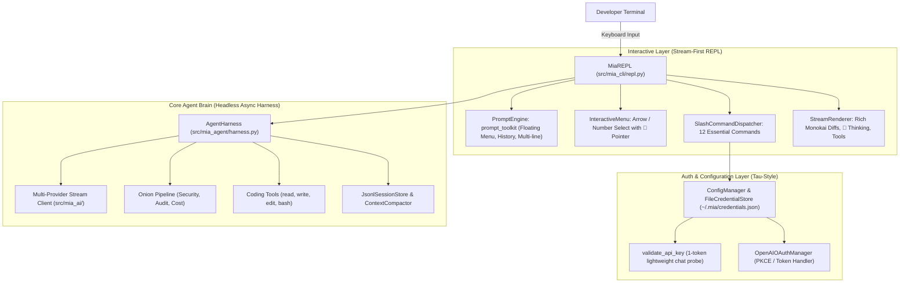

# Architecture & Technical Specification: Mia Minimalist Stream REPL

> **Architecture Style:** Minimalist Inline Stream REPL (Pi / Tau / Claude Code inspired)  
> **Key Accent:** Carrot Orange (`#FF7A00` / `\x1b[38;2;255;122;0m`)  
> **Design Contract:** Zero-flicker stability, non-blocking asynchronous execution, strict typing.

---

## 1. Domain Architecture & Component Boundaries

---

## 2. Terminal UI Architecture & Paradigm Comparison

### A. The 3 Terminal Paradigms

1. **Paradigm 1: Stream-First Inline REPL (Mia Target / Claude Code / Pi / Aider style)**
   * **Input:** `prompt_toolkit` (`PromptSession`, floating autocompletion menu on `/`, multi-line editing, persistent history search `Ctrl+R`).
   * **Output:** `Rich` (streaming tokens, thought blocks `💭`, single-line tool execution cards, Monokai syntax git diffs).
   * **UX:** Direct native terminal stream. Full trackpad/mouse scrollback, native click-and-drag text copying, zero screen hijacking.
2. **Paradigm 2: Full-Screen Virtual TUI (`Textual` / Ratatui)**
   * Takes over terminal in alternate screen buffer (`altscreen`). Good for dashboards, but breaks native scrollback and friction with copy-pasting.
3. **Paradigm 3: Standalone GUI (Tauri / Webview)**
   * External window; not a lightweight terminal harness.

### B. Terminal Input Mechanics (prompt_toolkit)
* Replaces raw manual `termios`/`readline` with `prompt_toolkit.PromptSession`.
* Instant floating completion dropdown on `/` that dynamically filters live as characters are typed (e.g. `/l` → `/login`, `/logout`).
* Complete clean screen teardown on submit with zero ghost popup artifacts.

---

## 2. Terminal Input & Selection Mechanics

### A. The Input Problem in Previous Implementations
Previous versions attempted character-by-character raw POSIX input (`setcbreak`) with manually calculated ANSI escape sequences (`\x1b[nA`, `\x1b[s`).
* When users resize the window, paste multi-line text, or type long commands that wrap physical terminal rows, relative row offsets become invalid.
* This caused cursor jumping, erased history lines, sliced text, and visual corruption.

### B. The Minimalist Solution
* Standard POSIX Readline with ANSI styling and persistent history (`~/.mia/history`).
* Multi-platform interactive picker for `/login` and `/model`:
  - Renders a clean numbered table with a signature `🥕 ` cursor.
  - Supports both **Up/Down arrow key navigation** and **instant direct numeric entry (1, 2, 3...)**.
  - Restores terminal state cleanly upon exit without leaving ghost artifacts.

---

## 3. Pi & Tau Auth & Model Scoping System

### A. Supported AI Providers
1. **`opencode-go`:** `https://opencode.ai/zen/go/v1` (Models: `mimo-v2.5`, `qwen2.5-coder-32b-instruct`, `deepseek-v3`)
2. **`openrouter`:** `https://openrouter.ai/api/v1` (Models: `anthropic/claude-3.7-sonnet`, `deepseek/deepseek-r1`, `openai/gpt-4o`)
3. **`gemini`:** `https://generativelanguage.googleapis.com/v1beta/openai/` (Models: `gemini-2.5-flash`, `gemini-2.5-pro`, `gemini-2.0-flash`)
4. **`openai`:** `https://api.openai.com/v1` (Models: `gpt-4o`, `gpt-4o-mini`, `o3-mini`, `o1`)
5. **`anthropic`:** `https://api.anthropic.com/v1` (Models: `claude-3-7-sonnet`, `claude-3-5-sonnet-20241022`, `claude-3-5-haiku`)
6. **`deepseek`:** `https://api.deepseek.com/v1` (Models: `deepseek-chat`, `deepseek-reasoner`)
7. **`custom`:** Local / OpenAI-Compatible (Ollama, vLLM, LMStudio at `http://localhost:11434/v1`)

### B. Connection Validation Probe
* Performs a minimal, fast completion request:
  `{"model": probe_model, "messages": [{"role": "user", "content": "hi"}], "max_tokens": 1}`
* If connection times out or fails with an unknown error, Mia provides a clear diagnostic warning and gives the user the option to save anyway rather than throwing a fatal blocker.

---

## 4. The 12 Essential Slash Commands Suite

1. **`/help`** (`/?`): Compact table of commands, shortcuts, and tool permissions.
2. **`/login`** (`/auth`): 2-option login wizard (API Key vs OpenAI Auth) with live probe.
3. **`/logout`** (`/signout`, `/disconnect`): Wipe stored credentials for one or all providers.
4. **`/model`** (`/llm`): Scoped model switcher showing authenticated providers + custom entry.
5. **`/profile`** (`/role`, `/persona`): Switch agent persona (`coding`, `architect`, `minimal`, `code_mode`).
6. **`/diff`** (`/changes`): Display syntax-highlighted git diff of modifications.
7. **`/cost`** (`/tokens`, `/stats`): Display real-time session tokens and estimated USD cost.
8. **`/compact`** (`/compress`): Check token usage against context window and trigger compaction.
9. **`/sessions`** (`/history`): List saved JSONL conversation trees.
10. **`/init`** (`/bootstrap`): Scan repository architecture and verify `AGENTS.md`.
11. **`/undo`** (`/revert`): Revert latest file change made by agent in this session.
12. **`/clear`** (`/cls`): Clear screen and redraw clean single-line header banner.
13. **`/quit`** (`/exit`): Save session and exit cleanly.

---

## 5. Minimalist Live Working Stream & Post-Turn Inspection (Antigravity & Codex Pattern)

### A. Active Turn Live Working Stream (Zero Screen Clutter)
* **Thinking State:** Animated spinner with live duration (`💭 Thinking (3.2s)...`). Raw reasoning tokens are buffered in memory and not spewed onto the terminal during streaming.
* **Tool Working State:** Compact single-line in-place status:
  - `⠋ Reading src/app.py...`
  - `⠋ Editing src/mia_cli/repl.py...`
  - `⠋ Searching codebase for 'PromptSession'...`
  - `⠋ Running 'pytest'...`
* **Tool Completed State:** Collapses immediately to a single-line badge:
  - `✓ Read src/app.py (80 lines)`
  - `✓ Edited src/mia_cli/repl.py`
  - `✓ Executed bash: pytest (passed)`
* **Zero Output Bloat:** Full 500-line file contents and multi-page tool outputs are never dumped raw into terminal scrollback during active streaming.

### B. Post-Turn Inspection & Toggle Keybindings
* Upon turn completion, Mia outputs the clean final answer and an unobtrusive bottom hint bar:
  `[Ctrl+O] Expand details & tool logs  •  [Ctrl+T] Toggle thinking trace  •  /help`
* **`Ctrl+O` (`/inspect`):** Opens a clean, scrollable inspection view showing full tool execution logs, arguments, and full file diffs.
* **`Ctrl+T` (`/thinking`):** Toggles display of the complete reasoning / thinking trace for the current and subsequent turns.
* **Customizable Working Indicator / Spinner Styles (Default: `carrot_bounce`):**
  - `carrot_bounce` (Default signature: `🥕 ` with smooth bounce animation)
  - `dots` (`⠋⠙⠹⠸⠼⠴⠦⠧⠇⠏`)
  - `pulse` (`·•●•·`)
  - `braille` (`⣾⣽⣻⢿⡿⣟⣯⣷`)

