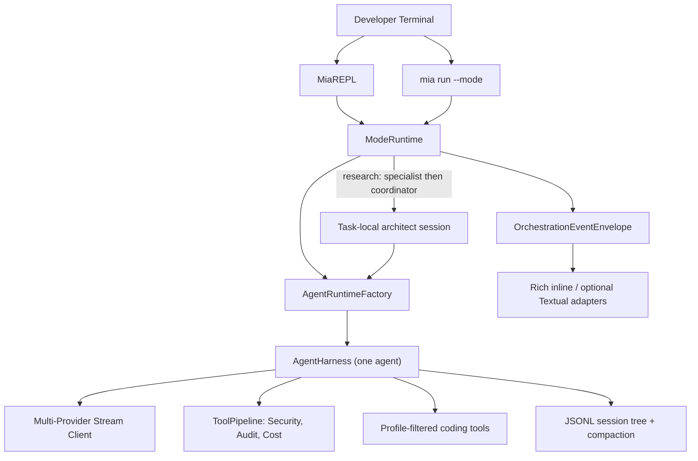
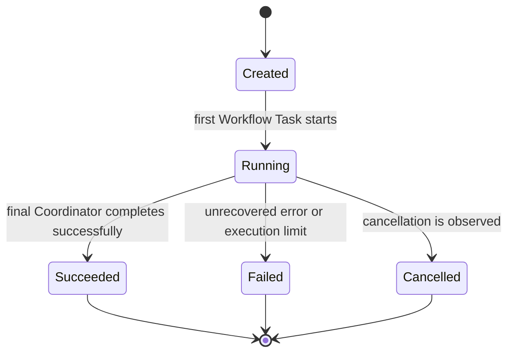
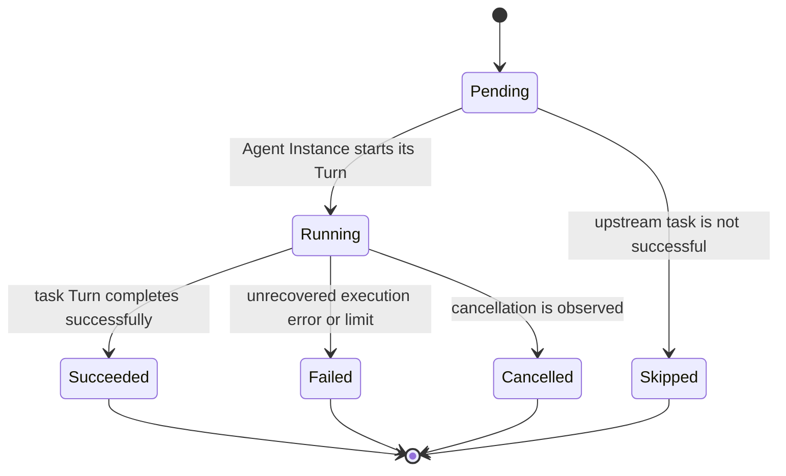
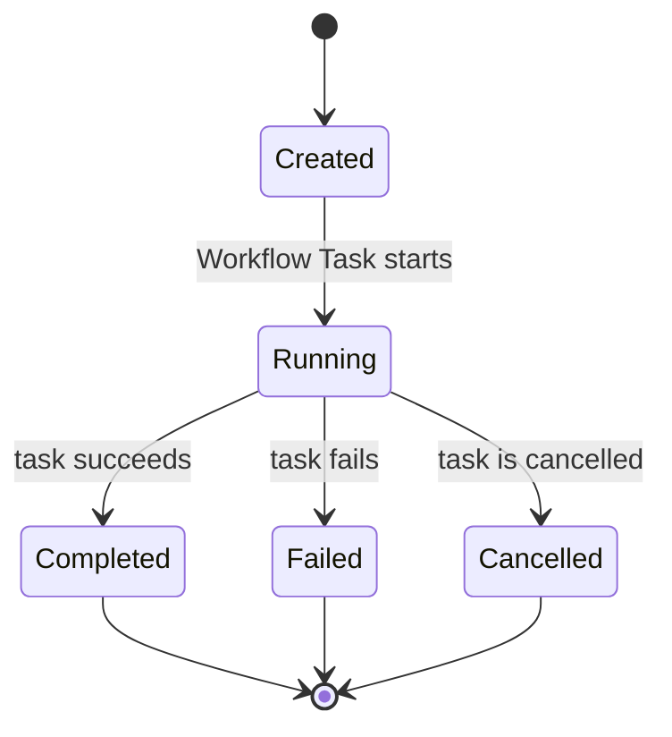
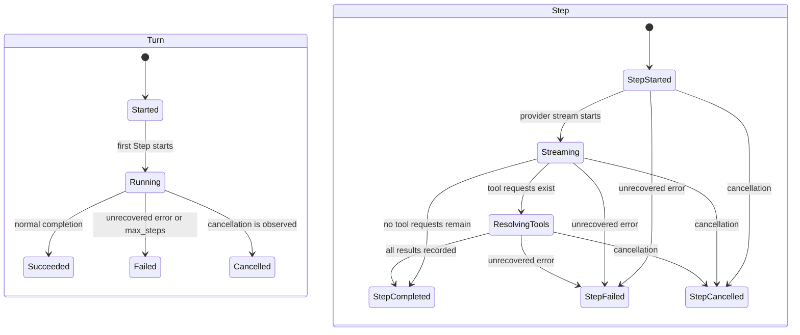
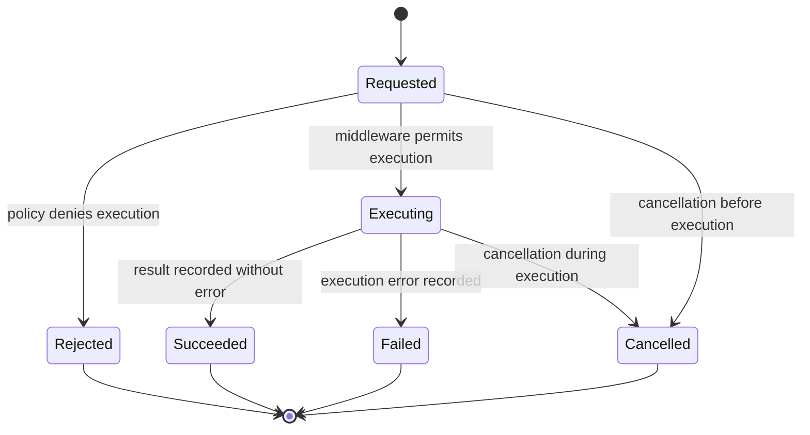

# Architecture & Technical Specification: Mia Native Orchestration Runtime

> **Architecture Style:** Minimalist Inline Stream REPL (Pi / Tau / Claude Code inspired)  
> **Key Accent:** Carrot Orange (`#FF7A00` / `\x1b[38;2;255;122;0m`)  
> **Design Contract:** Zero-flicker stability, non-blocking asynchronous execution, strict typing.

---

## 1. Domain Architecture & Component Boundaries



---

The implemented e03 composition invariant is: **Mode composes; Profile configures; Workflow coordinates; Agent executes; Plugin extends.** It documents current runtime behavior, not the approved target product taxonomy. The Agent-centric direction in `specs/product/VISION_LATEST.yaml` uses Agent as the single identity term, removes public Mode, keeps Workflow internal, and centers Agent-to-Agent Delegation. The approved e04 planning capsule defines the additive compatibility migration; implementation has not started.

`ModeRuntime` is the current shared headless execution seam for both `mia` and `mia run`. It resolves explicit `single` or `research` workflows, delegates construction to `AgentRuntimeFactory`, and emits `OrchestrationEventEnvelope` values that retain the inner `AgentEvent`. `AgentRuntimeFactory` owns provider, profile, tools, middleware, session restoration, compaction, and lineage metadata. `AgentHarness` remains a one-agent executor with no terminal UI dependency. Research children are task-local and durable, but not continuable.

## 2. Terminal UI Architecture & Paradigm Comparison

### A. The 3 Terminal Paradigms

1. **Paradigm 1: Stream-First Inline REPL (Mia Target / Claude Code / Pi / Aider style)**
   * **Input:** `prompt_toolkit` (`PromptSession`, floating autocompletion menu on `/`, multi-line editing, persistent history search `Ctrl+R`).
   * **Output:** `Rich` (streaming tokens, thought blocks `💭`, single-line tool execution cards, Monokai syntax git diffs).
   * **UX:** Direct native terminal stream. Full trackpad/mouse scrollback, native click-and-drag text copying, zero screen hijacking.
2. **Paradigm 2: Full-Screen Virtual TUI (`Textual` / Ratatui)**
   * Takes over terminal in alternate screen buffer (`altscreen`). Good for dashboards, but breaks native scrollback and friction with copy-pasting.
3. **Paradigm 3: Standalone GUI (Tauri / Webview)**
   * External window; not a lightweight terminal harness.

### B. Terminal Input Mechanics (prompt_toolkit)
* Replaces raw manual `termios`/`readline` with `prompt_toolkit.PromptSession`.
* Instant floating completion dropdown on `/` that dynamically filters live as characters are typed (e.g. `/l` → `/login`, `/logout`).
* Complete clean screen teardown on submit with zero ghost popup artifacts.


---

## 2. Terminal Input & Selection Mechanics

### A. The Input Problem in Previous Implementations
Previous versions attempted character-by-character raw POSIX input (`setcbreak`) with manually calculated ANSI escape sequences (`\x1b[nA`, `\x1b[s`).
* When users resize the window, paste multi-line text, or type long commands that wrap physical terminal rows, relative row offsets become invalid.
* This caused cursor jumping, erased history lines, sliced text, and visual corruption.

### B. The Minimalist Solution
* Standard POSIX Readline with ANSI styling and persistent history (`~/.mia/history`).
* Multi-platform interactive picker for `/login` and `/model`:
  - Renders a clean numbered table with a signature `🥕 ` cursor.
  - Supports both **Up/Down arrow key navigation** and **instant direct numeric entry (1, 2, 3...)**.
  - Restores terminal state cleanly upon exit without leaving ghost artifacts.

---

## 3. Pi & Tau Auth & Model Scoping System

### A. Supported AI Providers
1. **`opencode-go`:** `https://opencode.ai/zen/go/v1` (Models: `mimo-v2.5`, `qwen2.5-coder-32b-instruct`, `deepseek-v3`)
2. **`openrouter`:** `https://openrouter.ai/api/v1` (Models: `anthropic/claude-3.7-sonnet`, `deepseek/deepseek-r1`, `openai/gpt-4o`)
3. **`gemini`:** `https://generativelanguage.googleapis.com/v1beta/openai/` (Models: `gemini-2.5-flash`, `gemini-2.5-pro`, `gemini-2.0-flash`)
4. **`openai`:** `https://api.openai.com/v1` (Models: `gpt-4o`, `gpt-4o-mini`, `o3-mini`, `o1`)
5. **`anthropic`:** `https://api.anthropic.com/v1` (Models: `claude-3-7-sonnet`, `claude-3-5-sonnet-20241022`, `claude-3-5-haiku`)
6. **`deepseek`:** `https://api.deepseek.com/v1` (Models: `deepseek-chat`, `deepseek-reasoner`)
7. **`custom`:** Local / OpenAI-Compatible (Ollama, vLLM, LMStudio at `http://localhost:11434/v1`)

### B. Connection Validation Probe
* Performs a minimal, fast completion request:
  `{"model": probe_model, "messages": [{"role": "user", "content": "hi"}], "max_tokens": 1}`
* If connection times out or fails with an unknown error, Mia provides a clear diagnostic warning and gives the user the option to save anyway rather than throwing a fatal blocker.

---

## 4. Essential Slash Commands Suite

The inline REPL exposes **18 canonical commands**. Completion, help, and unique-prefix matching derive from the same ordered metadata list.

1. **`/help`** (`/?`): Show the command menu and aliases.
2. **`/login`** (`/auth`): Authenticate an AI provider.
3. **`/logout`** (`/signout`, `/disconnect`): Remove stored credentials.
4. **`/mode`**: Show or select the explicit `single` or `research` orchestration mode.
5. **`/model`** (`/llm`): Discover models from all connected providers in one selector, then switch the active model.
6. **`/scoped-models`**: Discover connected models and show or set the ordered list used by Ctrl+P cycling; `/model` selects from this list.
7. **`/profile`** (`/role`, `/persona`): Show or switch the coordinator profile.
8. **`/diff`** (`/changes`): Show the Git diff or report Git errors.
9. **`/cost`** (`/tokens`, `/stats`): Show session token and cost totals.
10. **`/compact`** (`/compress`): Compact active context when history is available and append a session checkpoint.
11. **`/sessions`** (`/history`): List saved JSONL conversation trees.
12. **`/resume`**: Restore or delete a saved session.
13. **`/tree`** (`/branch`): Explore and fork the session tree.
14. **`/inspect`** (`/logs`): Show post-turn audit details.
15. **`/thinking`** (`/trace`): Toggle model reasoning trace visibility.
16. **`/init`** (`/bootstrap`): Check for `.git`, `AGENTS.md`, and `README.md`.
17. **`/clear`** (`/cls`): Clear the terminal and redraw the banner.
18. **`/quit`** (`/exit`): Save the session, show its ID, and print `mia --session <id>`.

**Deferred active-turn cancellation:** `/stop` and `/abort` are not advertised until the serial REPL can receive input while a turn is running and cancel provider streams and tool processes safely.

---

## 5. Minimalist Live Working Stream & Post-Turn Inspection (Antigravity & Codex Pattern)

### A. Active Turn Live Working Stream (Zero Screen Clutter)
* **Thinking State:** Animated spinner with live duration (`💭 Thinking (3.2s)...`). Raw reasoning tokens are buffered in memory and not spewed onto the terminal during streaming.
* **Tool Working State:** Compact single-line in-place status:
  - `⠋ Reading src/app.py...`
  - `⠋ Editing src/mia_cli/repl.py...`
  - `⠋ Searching codebase for 'PromptSession'...`
  - `⠋ Running 'pytest'...`
* **Tool Completed State:** Collapses immediately to a single-line badge:
  - `✓ Read src/app.py (80 lines)`
  - `✓ Edited src/mia_cli/repl.py`
  - `✓ Executed bash: pytest (passed)`
* **Zero Output Bloat:** Full 500-line file contents and multi-page tool outputs are never dumped raw into terminal scrollback during active streaming.

### B. Post-Turn Inspection & Toggle Keybindings
* Upon turn completion, Mia outputs the clean final answer and an unobtrusive bottom hint bar:
  `[Ctrl+O] Expand details & tool logs  •  [Ctrl+T] Toggle thinking trace  •  /help`
* **`Ctrl+O` (`/inspect`):** Opens a clean, scrollable inspection view showing full tool execution logs, arguments, and full file diffs.
* **`Ctrl+T` (`/thinking`):** Toggles display of the complete reasoning / thinking trace for the current and subsequent turns.
* **Customizable Working Indicator / Spinner Styles (Default: `carrot_bounce`):**
  - `carrot_bounce` (Default signature: `🥕 ` with smooth bounce animation)
  - `dots` (`⠋⠙⠹⠸⠼⠴⠦⠧⠇⠏`)
  - `pulse` (`·•●•·`)
  - `braille` (`⣾⣽⣻⢿⡿⣟⣯⣷`)

---

## 6. Tool Execution & Approval Flow (Profile-Driven Hybrid)

Mia uses a profile-driven execution model enforced via the `SecurityGuardMiddleware` pipeline:

1. **`coding` Profile (Default):**
   * **Execution:** Autonomous execution with zero interrupting prompts.
   * **Safety:** File modifications and turns are tracked in session JSONL history; users can inspect via `Ctrl+O` or branch back with `/tree`.
   * **Speed:** Fast and fluid developer loop.

2. **`strict` Profile:**
   * **Execution:** Interactive confirmation gate on all write and execution tools (`edit_file`, `write_file`, `bash`).
   * **Prompt:** `Approve edit to src/app.py? [y/n/d(iff)/a(ll)] › `

3. **`architect` Profile:**
   * **Execution:** Read-only mode (`read_file`, search); write and bash tools are disallowed.

4. **Universal Background Guardrail:**
   * `SecurityGuardMiddleware` actively blocks catastrophic or out-of-workspace actions (e.g. `rm -rf /`, directory traversal escapes, credential leaks) regardless of active profile.

---

## 7. Keyboard Shortcuts & Tree Navigation (Pi & Tau Standard)

| Keybinding | Action | Behavior |
| :--- | :--- | :--- |
| **`Enter`** | Submit Prompt | Submits active prompt or executes slash command |
| **`Shift+Enter`** | Multi-Line Newline | Inserts a newline without submitting |
| **`Ctrl+C`** | Clear Input Buffer | Clears the current typed text in prompt without killing session |
| **`Ctrl+D`** | Exit Session | Saves session JSONL tree and terminates cleanly |
| **`Ctrl+L`** | Select Model | Opens the all-connected-provider model selector |
| **`Ctrl+P`** | Cycle Model | Selects the next model configured by `/scoped-models` |
| **`Shift+Tab`** | Toggle Thinking Trace | Toggles live visibility of model reasoning tokens; Ctrl+Tab is not distinct from Tab in standard terminals |
| **`Ctrl+O`** | Expand/Collapse Logs | Toggles detailed audit view of tool arguments and file diffs |
| **`Ctrl+T`** | Toggle Thinking Trace | Also toggles live visibility of model reasoning tokens |
| **`Esc Esc` (or `/tree`)** | Session Tree Fork | On an empty prompt, double-Esc within 500 ms opens the tree browser to jump to a checkpoint or fork |
| **`Ctrl+D` / `d` in `/resume`** | Delete Session | Asks for Enter confirmation; Esc cancels. The active session cannot be deleted. |

---

## 8. Prompt Ergonomics & Live Status Footer (Pi Standard)

### A. Bracketed Paste & Multi-Line Editor
* **Multi-Line Paste:** Pasted code blocks and stack traces are handled natively via `prompt_toolkit` bracketed paste mode with preserved indentation and full arrow-key multi-line editing.
* **Submission:** Standard `Enter` submits prompts; `Shift+Enter` inserts newlines.

### B. Live Pinned Status Footer
* Pinned directly below the `prompt_toolkit` input prompt line:
  ```
  ──────────────────────────────────────────────────────────────────────────
  📁 <workspace>  •  🧠 <model>  •  ⚡ <tokens>/<window> (<pct>%)  •  Esc Esc: Tree  •  Ctrl+O: Logs
  ```
* Dynamically updates tokens and context window percentage as turns execute.

---

## 9. Context Bootstrap & Automatic Compaction (Tau / Pi Standard)

### A. Repository Context Check
* **Inspection (`/init`):** Developers can check whether `.git`, `AGENTS.md`, and `README.md` exist in the working directory. This command does not scan architecture or compile a system prompt.

### B. Automatic Context Compaction (`/compact`)
* **Threshold (Default: 80% of window or configurable):**
  - When cumulative token count exceeds 80% of the active model's context window:
  - Mia automatically summarizes early conversation turns into a structured summary checkpoint node in the session JSONL tree.
  - Emits a clean notification: `⚡ Context compacted: 86k → 14k tokens (-83%)`.
  - Can also be triggered manually anytime via **`/compact`**.

---

## 10. Implemented e03 Orchestration Domain Model

This section records the current ModeRuntime architecture and its previously accepted lifecycle semantics. `specs/product/GLOSSARY_LATEST.yaml` and `specs/UBIQUITOUS_LANGUAGE_LATEST.md` define the approved Agent-centric target language. Existing Profile, Mode, Workflow Task, Agent Instance, Coordinator, and Specialist descriptions below remain implementation evidence until the approved e04 migration replaces or internalizes them.

### Aggregate ownership

**Orchestration Run** is the orchestration aggregate root. It owns ordered **Workflow Tasks** and one final outcome. **Agent Instances** execute tasks. **Sessions** preserve durable conversation history outside the run lifecycle.

### Orchestration Run state model



`Succeeded`, `Failed`, and `Cancelled` are terminal. Only successful final **Coordinator** completion yields `Succeeded`. `max_steps` and unrecovered provider or orchestration errors yield `Failed`.

**Current contradiction:** `AgentHarness.prompt()` emits `TurnCompleteEvent(stop_reason="max_steps")`, and provider error chunks can still lead to `stop_reason="stop"`. Consumers cannot derive strict run success from event type alone. This foundation records the desired semantics without changing code.

### Workflow Task state model



All four outcomes are terminal. A `Failed` task fails its **Orchestration Run**. A `Cancelled` task cancels its run. Every later `Pending` task becomes `Skipped`. A tool error remains recoverable inside a task until the task reaches a terminal outcome.

**Current gap:** Native orchestration emits no explicit task-start, task-complete, or task-skipped events. Research mode enforces fail-fast control flow, but downstream `Skipped` state remains implicit.

### Identity scope

One submitted prompt creates exactly one **Orchestration Run**. A **Session** spans zero or more runs and preserves their shared conversation history. Run identifiers MUST remain unique across prompts, including resumed sessions.

**Current contradiction:** Interactive single mode reuses `run_id=f"run_{session_id}"` with one long-lived runtime. Research mode creates a new run identifier per prompt. Native attribution therefore has mode-dependent run identity today.

### Agent Instance state model



An **Agent Instance** is task-scoped and reaches one terminal state. Its **Session** survives it. A later prompt creates a new run and agent instance that can reopen the same session.

**Current contradiction:** Interactive single mode reuses one `AgentRuntime` and `AgentHarness` across prompts. The implementation currently behaves as a session-scoped executor, unlike research specialists.

### Turn and Step state models



A **Turn** reaches `Succeeded`, `Failed`, or `Cancelled`. A **Step** reaches `Completed`, `Failed`, or `Cancelled`. `max_steps` is a failed Turn outcome, not success.

### Tool Invocation state model



A failed or rejected **Tool Invocation** is recoverable. Its result remains part of the completed **Step**, allowing a later Step to react. Only an unrecovered exception, policy decision, execution limit, or cancellation terminates the Turn.

**Current gap:** `ToolResultEvent.is_error` does not distinguish `Failed` from `Rejected`. Cancellation can end execution without a terminal tool or step event.

### Session semantics

A **Session** has no lifecycle state. It exists as append-only history until explicit deletion. “Active” describes a runtime selecting that session, not a stored session state. Resuming creates a new **Agent Instance** without reopening or mutating the session.

A **Session Tree** never rewrites existing entries. A **Session Branch** is the selected root-to-leaf replay path. Selecting or forking a branch changes the active leaf pointer without deleting sibling history. A **Compaction Checkpoint** changes replay context without replacing stored history.

A root **Session** has no parent. A child session has exactly one immutable parent session. Session lineage is acyclic, and parent and child histories never merge. Parent deletion MUST NOT silently orphan a child.

**Current gap:** `parent_session_id` is persisted inside namespaced orchestration metadata, but no constraint prevents conflicting parents, cycles, or orphaning.

### Concurrency

Mia permits concurrency across different **Sessions**. One Session permits at most one active **Turn** and one writing **Agent Instance**. An overlapping run targeting the same session MUST be queued or rejected. Current research workflow tasks remain sequential.

| Shared mutable location | Readers | Writers | Synchronization | Risk |
|-------------------------|---------|---------|-----------------|------|
| `AgentHarness._messages`, counters, and last entry | Harness, compactor, session navigation | `prompt`, compaction, navigation | Serial REPL assumption only | **HIGH:** concurrent prompts corrupt context and attribution |
| One `JsonlSessionStore` file | Runtime restoration and tree navigation | Harness and identity persistence | None | **HIGH:** concurrent appends can interleave or create conflicting parents |
| `CostBudgetMiddleware` counters | Budget checks and inspection | Every tool invocation | None | **HIGH:** check-then-increment races and reused-runtime leakage |
| `AuditLogMiddleware.logs` | Inspection UI and tests | Every tool invocation | None | **MEDIUM:** concurrent ordering becomes nondeterministic |
| `ToolPipeline.middlewares` | Every tool invocation | Setup through `use()` | Construction-time convention | **MEDIUM:** runtime mutation can alter an active chain |
| `SessionTree` indexes and active leaf | Replay and navigation | `add_entry()` | Instance-local use | **LOW:** unsafe only if one tree object is shared concurrently |

No lock, actor, or compare-and-swap mechanism enforces the per-Session invariant today. The serial inline REPL avoids the race by control flow, not by the headless runtime contract.

### Domain invariants

1. A run resolves and validates its **Mode**, **Workflow**, stages, and **Profiles** exactly once at creation.
2. Definition changes affect later runs only; an active run uses its immutable resolved definitions.
3. A **Workflow** contains exactly one final **Coordinator** stage and currently at most one **Specialist** stage.
4. One submitted prompt creates one run; one session can span many sequential runs.
5. `task_id` and `agent_id` are unique within one run; `step_index` is unique within one turn.
6. `call_id` identifies one **Tool Invocation** within its step and correlates exactly one terminal result.
7. Every **Orchestration Event Envelope** identity matches the emitting agent instance's **Runtime Identity**.
8. Every reached **Workflow Stage** creates exactly one task, agent instance, profile binding, and session binding.
9. Only successful final coordinator completion succeeds a run.
10. Failure or cancellation prevents downstream execution and marks unstarted tasks `Skipped`.
11. Terminal entities never transition again.
12. Session entries are immutable, parent references are acyclic, and compaction never deletes stored history.
13. One session has at most one active turn and one writer.
14. Every visible tool is profile-authorized and executes through the configured middleware pipeline.
15. Legacy Herd models and `AgentState` never define native orchestration semantics.

**Current gap:** Mode and workflow Pydantic models are mutable, and profiles are resolved while each agent runtime is built. The code has no explicit immutable run-definition snapshot.

### Event-derived state mapping

| Entity transition | Current evidence | Gap |
|-------------------|------------------|-----|
| Run or task `Created/Pending → Running` | First attributable `TurnStartEvent` | No explicit run/task start event |
| Agent Instance `Created → Running` | First attributable `TurnStartEvent` | Construction is not emitted |
| Turn `Started → Running` | `TurnStartEvent`, then `StepStartEvent` | None |
| Step `Started → Completed` | `StepStartEvent`, then `StepEndEvent` | No explicit failed or cancelled step event |
| Tool `Requested → Executing` | `ToolCallEvent` followed by middleware dispatch | Execution start is not emitted separately |
| Tool `Executing → Succeeded/Failed` | `ToolResultEvent.is_error` | Rejection and execution failure are conflated |
| Turn or task `Running → Succeeded` | `TurnCompleteEvent(stop_reason="stop")` | Provider error chunks can still produce this event |
| Turn or task `Running → Failed` | `AgentErrorEvent`, orchestration error, or `max_steps` | `max_steps` uses TurnComplete; provider errors lack reliable terminal typing |
| Run or task `Running → Cancelled` | `OrchestrationErrorEvent(cancelled=true)` | Inner agent, step, and tool terminal events can be absent |
| Downstream task `Pending → Skipped` | Research control flow returns before coordinator creation | No explicit skipped event |

### Decision records

- [ADR-0001: Use prompt-scoped orchestration runs and session-spanning history](../adr/0001-prompt-scoped-orchestration-runs.md)

